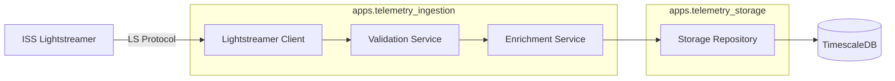

# Telemetry Ingestion Module Design

**Status**: Draft
**Epic**: Implement Ingestion Service
**Date**: 2025-12-05
**Reviewer**: Software Architect (Approved with Modifications)

## 1. Overview

The `telemetry_ingestion` module is responsible for connecting to the ISS Lightstreamer service, maintaining a persistent connection, and ingesting real-time telemetry data. It acts as the "gateway" for data entering the system, ensuring all data is validated, enriched, and standardized before being passed to the storage layer.

Per the **Modular Monolith** architecture, this module **does not own** the database models. It relies on `apps.telemetry_storage` for data persistence definitions (`TelemetryReading`, `TelemetryChannel`) and repository access.

## 2. Architecture & Dependencies

### 2.1 Core Responsibilities
1.  **Connect**: Establish/Maintain connection to ISS Lightstreamer via `lightstreamer-client-lib`.
2.  **Subscribe**: Manage subscriptions for ~400 telemetry items (channels) dynamically loaded from the database.
3.  **Validate**: Enforce schema and data integrity using **DRF Serializers** (detached from views).
4.  **Enrich**: Add system metadata (UUIDs, ingestion timestamps).
5.  **Persist**: Hand off validated data to `telemetry_storage` repositories using non-blocking Async ORM.

### 2.2 Module Boundaries
*   **Inbound**: Real-time stream from `push.lightstreamer.com` or HTTP injection (dev/testing).
*   **Outbound**: Writes to `TimescaleDB` via `apps.telemetry_storage`.
*   **Internal Dependencies**:
    *   `apps.core`: Base exceptions, utilities.
    *   `apps.telemetry_storage`: Imports Models (`TelemetryReading`, `TelemetryChannel`) and Repositories.

## 3. Component Design

### 3.1 Lightstreamer Client Service
**File**: `apps/telemetry_ingestion/services/lightstreamer_client.py`

A robust, asynchronous wrapper around the Lightstreamer protocol.

*   **Class**: `LightstreamerService`
*   **Key Features**:
    *   **AsyncIO**: Built on `asyncio` to handle high-concurrency I/O.
    *   **Connection Management**: Automatic reconnection with exponential backoff.
    *   **Subscription Management**:
        *   **Source**: Loads active channels from `TelemetryChannel.objects.filter(deleted_at__isnull=True)` at startup.
        *   **Modes**: `MERGE` (most common for telemetry), `DISTINCT`.
    *   **Callback Handling**: Maps inbound `on_item_update` events to the processing pipeline.

### 3.2 Validation Service
**File**: `apps/telemetry_ingestion/serializers.py`

Uses Django REST Framework (DRF) serializers for robust validation.

*   **Class**: `IngestTelemetrySerializer`
*   **Fields**:
    *   `item_id` (Required, String) -> Maps to `public_pui`
    *   `timestamp` (Required, DateTime)
    *   `value` (Required, Numeric/String)
    *   `status` (Optional, Metadata)
*   **Validation Rules**:
    *   **Timestamp Sanity**: Reject dates > future (+buffer) or too old (< 30 days).
    *   **Type Safety**: Ensure numerical values are actually numbers where expected.
    *   **Format Check**: Validate specific ISS status codes.
*   **Performance Note**: While DRF is the primary choice, if benchmarking shows it cannot sustain 10k msg/sec (consuming >200ms per batch), the hot path should be refactored to use **Pydantic** or `TypedDict` while keeping DRF for the API.

### 3.3 Enrichment Service
**File**: `apps/telemetry_ingestion/services/enricher.py`

Transforms raw, validated data into a domain object ready for storage.

*   **Responsibilities**:
    *   **ID Generation**: Generate deterministic or random `id` (UUIDv7).
    *   **Timestamping**: Add `created_at` (Server UTC time).
    *   **Normalization**: Convert Lightstreamer field names (e.g., `Value`, `TimeStamp`) to Snake Case (`value`, `timestamp`).

### 3.4 Management Command
**File**: `apps/telemetry_ingestion/management/commands/run_lightstreamer.py`

The entry point for the ingestion worker.

*   **Usage**: `python manage.py run_lightstreamer`
*   **Logic**:
    1.  Initialize `LightstreamerService`.
    2.  Load target channels from DB (Sync to Async).
    3.  Connect and Subscribe.
    4.  Enter event loop (indefinite run).
    5.  Handle shutdown signals (`SIGINT`, `SIGTERM`) gracefully.

### 3.5 Service Interaction & Data Passing

The `LightstreamerService` acts as the central **orchestrator**.

*   **Orchestration**: The `on_item_update` callback triggers the pipeline.
*   **Direct Invocation**:
    1.  **Raw Data -> Validator**: Raw dict passed to `IngestTelemetrySerializer(data=raw_data)`.
    2.  **Validated Data -> Enricher**: Validated dict passed to `EnrichmentService`.
    3.  **Enriched Data -> Batch Buffer**: Domain object appended to internal buffer.
*   **Asynchronous Flush**: 
    *   A separate `asyncio.Task` monitors the buffer.
    *   Uses `TelemetryReading.objects.abulk_create(..., ignore_conflicts=True)` to persist data.
    *   **Async ORM** is mandatory to prevent blocking the reactor loop.

## 4. Data Flow

1.  **Ingest**: Lightstreamer pushes an update for `NODE3000004`.
2.  **Parse**: `LightstreamerService` converts the LS message into a Python dict.
3.  **Validate**: Data passed to `IngestTelemetrySerializer`.
    *   *Failure*: Log error, increment `ingestion_errors_total` metric, drop message.
4.  **Enrich**: Validated dict passed to `Enricher`.
    *   Adds `uuid`, `ingested_at`.
5.  **Persist**: Push to internal buffer.
    *   **Batch Processing**: Flush buffer to `Repository.bulk_create_readings(dtos)`.
    *   **Resilience**: Uses `ignore_conflicts=True` (PostgreSQL `ON CONFLICT DO NOTHING`) to ensure one bad record doesn't fail the whole batch.

## 5. Error Handling & Resilience

*   **Connection Loss**:
    *   Strategy: Exponential Backoff (1s, 2s, 4s... max 60s).
*   **Bad Data**:
    *   Strategy: "Fail Fast & Log". Use Serializer `is_valid(raise_exception=False)`.
*   **Database Pressure (Backpressure)**:
    *   **Buffer Strategy**: If buffer fills (e.g., DB down), **Drop Newest** to preserve historical continuity for analytics (sliding windows).
    *   **Metrics**: Expose `ingestion_buffer_size` and `ingestion_dropped_messages` to Prometheus.
*   **Batch Failures**:
    *   Primary: `ignore_conflicts=True`.
    *   Fallback: If batch fails (e.g., connection error), retry once, then log and drop to prevent blocking.

## 6. Testing Strategy

### 6.1 Unit Tests
**Location**: `apps/telemetry_ingestion/tests/`
*   **Validators**: Test Serializer with edge cases. Benchmark performance to ensure acceptable overhead.
*   **Enricher**: Verify UUID generation and timestamp addition.
*   **Service Logic**: Test backoff calculation logic.

### 6.2 Integration Tests
**Location**: `tests/` (Project Root)
*   **Mock Lightstreamer**: Use `unittest.mock` to simulate incoming LS messages.
*   **DB Integration**: Verify `abulk_create` correctly writes to TimescaleDB.
*   **Performance**: Simple load test to verify validation speed.

## 7. Implementation Plan

1.  **Define Interfaces**: Create the DTO structures.
2.  **Implement Storage Access**: Ensure `telemetry_storage` repository exposes an `async` create method.
3.  **Build Validator**: Implement the DRF Serializer.
4.  **Build Client**: Implement the `LightstreamerService`.
5.  **Wire Up Command**: Create the management command, ensuring it loads channels from DB.
6.  **Verify**: Run against ISS live server (or mock) and check TimescaleDB.